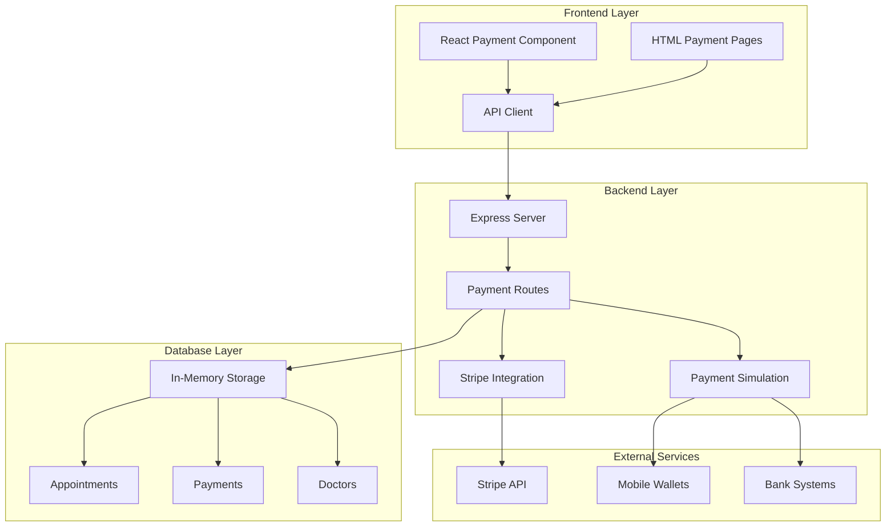
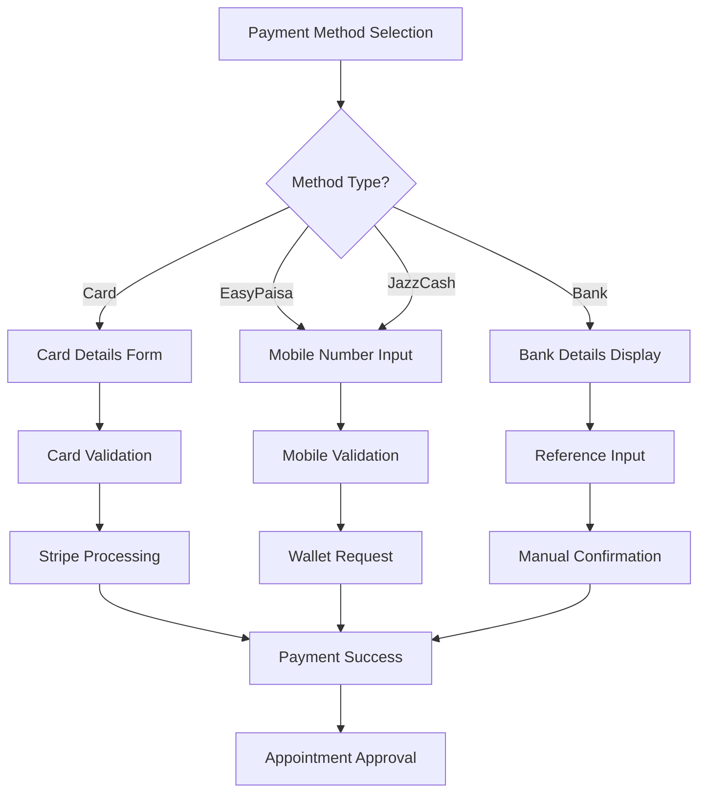
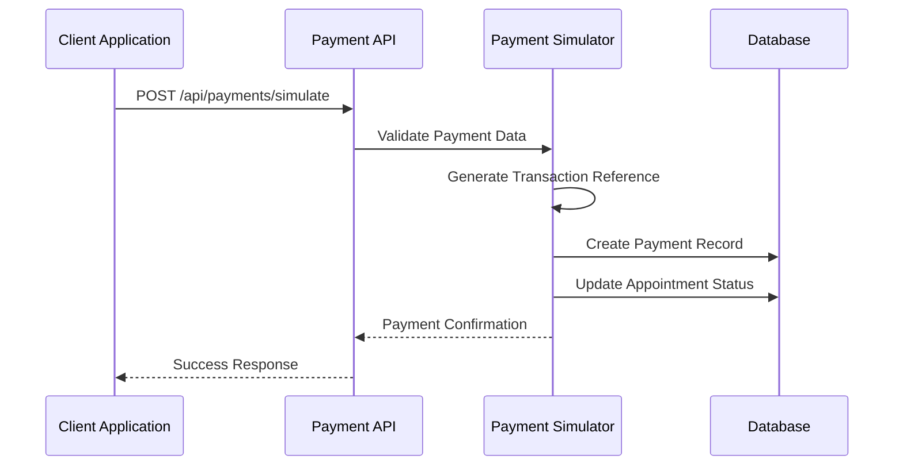
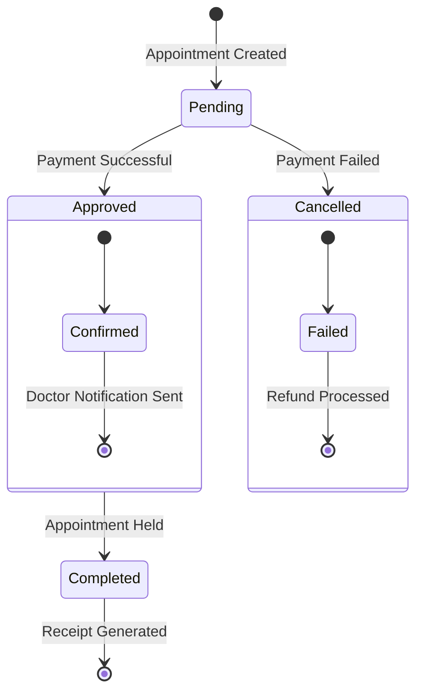
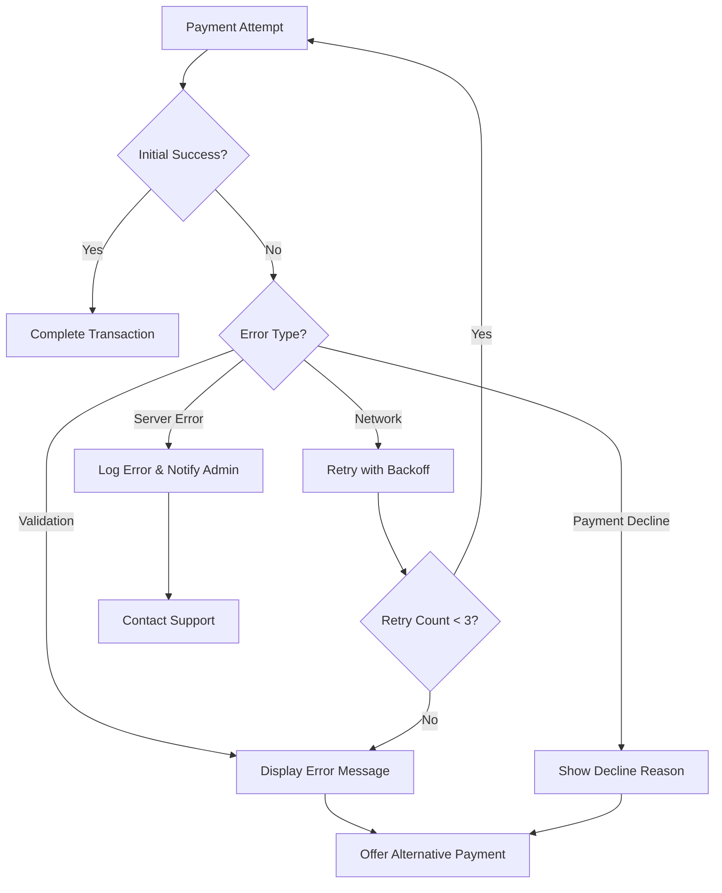

# Payment Processing System

<cite>
**Referenced Files in This Document**
- [Payment.jsx](file://Payment.jsx)
- [server.js](file://server.js)
- [api.js](file://api.js)
- [package.json](file://package.json)
- [README.md](file://README.md)
- [BookAppointment.jsx](file://BookAppointment.jsx)
- [index.html](file://index.html)
- [app.js](file://app.js)
</cite>

## Table of Contents
1. [Introduction](#introduction)
2. [System Architecture](#system-architecture)
3. [Payment Methods Implementation](#payment-methods-implementation)
4. [Fee Calculation System](#fee-calculation-system)
5. [Payment Simulation Engine](#payment-simulation-engine)
6. [Receipt Generation System](#receipt-generation-system)
7. [Appointment Integration](#appointment-integration)
8. [Security and Compliance](#security-and-compliance)
9. [Error Handling and Retry Mechanisms](#error-handling-and-retry-mechanisms)
10. [Testing Strategies](#testing-strategies)
11. [Webhook Implementation](#webhook-implementation)
12. [Audit Trail and Notifications](#audit-trail-and-notifications)
13. [Troubleshooting Guide](#troubleshooting-guide)
14. [Conclusion](#conclusion)

## Introduction

The Doctor appointment booking platform implements a comprehensive payment processing system designed specifically for healthcare appointment bookings. The system supports multiple payment methods including credit/debit cards, mobile wallets (EasyPaisa and JazzCash), and bank transfers, all integrated with a robust consultation fee calculation system and secure receipt generation.

The payment system is built with a dual-layer architecture that seamlessly integrates Stripe payment processing for production environments while maintaining a comprehensive simulation engine for development and testing. This ensures developers can test the entire payment workflow without requiring actual payment processing capabilities during development.

## System Architecture

The payment processing system follows a client-server architecture with clear separation of concerns between frontend payment interface, backend payment processing, and database storage.

**Diagram sources**
- [Payment.jsx](file://Payment.jsx#L23-L350)
- [server.js](file://server.js#L283-L377)
- [api.js](file://api.js#L39-L44)

The architecture supports three distinct payment pathways:
- **Production Path**: Direct Stripe integration for real payments
- **Simulation Path**: Local payment processing for development
- **Hybrid Path**: Automatic fallback between production and simulation

## Payment Methods Implementation

The system supports four primary payment methods, each with specific validation rules and processing logic:

### Card Payment Method
Credit and debit card payments utilize Stripe's PCI-compliant payment processing with automatic card validation and secure tokenization.

### Mobile Wallet Integration
EasyPaisa and JazzCash payments integrate with mobile wallet providers through simulated payment requests, displaying real-time instructions for users.

### Bank Transfer System
Direct bank transfer support includes detailed banking information display and transaction reference validation.

**Diagram sources**
- [Payment.jsx](file://Payment.jsx#L8-L13)
- [Payment.jsx](file://Payment.jsx#L62-L98)

**Section sources**
- [Payment.jsx](file://Payment.jsx#L8-L13)
- [Payment.jsx](file://Payment.jsx#L62-L98)
- [index.html](file://index.html#L340-L413)

## Fee Calculation System

The consultation fee system implements dynamic pricing based on doctor specialization with predefined rates:

| Specialization | Fee (PKR) |
|---------------|-----------|
| Cardiologist | 2,500 |
| Neurologist | 2,200 |
| Dermatologist | 1,500 |
| Orthopedic | 2,000 |
| Pediatrician | 1,200 |
| General Physician | 800 |

The fee calculation integrates seamlessly with the appointment booking process, automatically determining the appropriate rate based on the selected doctor's specialization.

**Section sources**
- [server.js](file://server.js#L288-L295)
- [server.js](file://server.js#L373-L377)

## Payment Simulation Engine

The simulation engine provides a comprehensive development and testing environment that mimics real payment processing without requiring external payment providers:

### Simulation Features
- **Realistic Validation**: Full input validation matching production requirements
- **Transaction Generation**: Automatic transaction reference creation
- **Status Management**: Complete payment lifecycle simulation
- **Error Scenarios**: Configurable failure modes for testing

### Simulation Workflow

**Diagram sources**
- [server.js](file://server.js#L318-L353)

**Section sources**
- [server.js](file://server.js#L318-L353)

## Receipt Generation System

The receipt generation system creates comprehensive payment confirmations with detailed transaction information:

### Receipt Components
- **Transaction Details**: Unique transaction reference and payment amount
- **Appointment Information**: Doctor name, specialization, date, and time
- **Payment Method**: Selected payment method with validation
- **Status Confirmation**: Clear payment status indication
- **Print Functionality**: Integrated browser printing support

### Receipt Template Structure
The system generates printable receipts with professional formatting suitable for both digital and physical documentation requirements.

**Section sources**
- [Payment.jsx](file://Payment.jsx#L260-L280)
- [app.js](file://app.js#L637-L662)

## Appointment Integration

The payment system maintains seamless integration with the appointment management system:

### Payment-to-Appointment Flow

**Diagram sources**
- [server.js](file://server.js#L347-L350)

### Integration Benefits
- **Automatic Approval**: Successful payments immediately approve appointments
- **Status Synchronization**: Real-time payment status updates
- **Conflict Prevention**: Payment verification prevents double-booking
- **Audit Trail**: Complete payment and appointment history tracking

**Section sources**
- [server.js](file://server.js#L347-L350)
- [BookAppointment.jsx](file://BookAppointment.jsx#L39-L60)

## Security and Compliance

The payment system implements multiple layers of security to ensure PCI compliance and data protection:

### Security Measures
- **PCI Compliant Processing**: Stripe integration handles sensitive payment data
- **Data Encryption**: All payment information transmitted via HTTPS
- **Tokenization**: Card details never stored locally
- **Input Validation**: Comprehensive front-end and back-end validation
- **Session Management**: Secure JWT token handling

### Compliance Features
- **256-bit SSL Encryption**: End-to-end communication security
- **GDPR Compliant**: Minimal data collection and storage
- **Audit Logging**: Complete transaction and access logging
- **Data Retention**: Automatic cleanup of temporary payment data

**Section sources**
- [Payment.jsx](file://Payment.jsx#L283-L287)
- [server.js](file://server.js#L11-L15)

## Error Handling and Retry Mechanisms

The payment system implements comprehensive error handling with graceful degradation:

### Error Categories
- **Validation Errors**: Input format and completeness checks
- **Network Errors**: Stripe connectivity and timeout handling
- **Payment Declines**: Card rejection and insufficient funds scenarios
- **System Errors**: Internal server and database failures

### Retry Strategy

**Diagram sources**
- [Payment.jsx](file://Payment.jsx#L94-L98)

**Section sources**
- [Payment.jsx](file://Payment.jsx#L94-L98)

## Testing Strategies

The system provides comprehensive testing capabilities for all payment scenarios:

### Test Environment Setup
- **Development Mode**: Automatic simulation activation
- **Test Cards**: Predefined test card numbers for validation
- **Error Injection**: Configurable failure scenarios
- **Performance Testing**: Load testing with simulated traffic

### Testing Scenarios
- **Successful Payments**: End-to-end payment flow validation
- **Failed Payments**: Declined card and insufficient funds testing
- **Network Failures**: Connectivity and timeout scenario testing
- **Race Conditions**: Concurrent booking and payment conflicts
- **Edge Cases**: Boundary value and invalid input testing

**Section sources**
- [README.md](file://README.md#L152-L159)

## Webhook Implementation

The system includes comprehensive webhook infrastructure for real-time payment event processing:

### Webhook Features
- **Event Subscription**: Automatic Stripe webhook registration
- **Event Handling**: Real-time payment status updates
- **Idempotency**: Duplicate event prevention and handling
- **Failure Recovery**: Automatic retry for failed webhook deliveries

### Supported Events
- **payment.succeeded**: Successful payment confirmation
- **payment.failed**: Payment failure notification
- **charge.refunded**: Refund processing events
- **invoice.payment_action_required**: Additional action required

**Section sources**
- [server.js](file://server.js#L11-L15)

## Audit Trail and Notifications

The payment system maintains comprehensive audit trails and notification systems:

### Audit Trail Components
- **Transaction Logs**: Complete payment lifecycle tracking
- **User Activity**: Payment attempt and success/failure records
- **System Events**: API calls and internal system operations
- **Error Tracking**: Detailed error logs and resolution attempts

### Notification System
- **Email Notifications**: Payment confirmation and status updates
- **SMS Alerts**: Mobile notification for critical events
- **Dashboard Alerts**: Real-time admin notifications
- **Audit Reports**: Periodic compliance and activity reports

**Section sources**
- [server.js](file://server.js#L355-L370)

## Troubleshooting Guide

Common payment processing issues and their resolutions:

### Payment Failures
- **Card Declined**: Verify card details and contact card issuer
- **Insufficient Funds**: Recommend alternative payment method
- **Network Timeout**: Retry payment after network stabilization
- **Validation Errors**: Correct input format and required fields

### System Issues
- **Stripe Unavailable**: System automatically switches to simulation mode
- **Database Connection**: Check connection string and credentials
- **API Timeout**: Verify server resources and network connectivity
- **Authentication Failure**: Reset session and re-authenticate user

### Development Debugging
- **Simulation Mode**: Enable for local development testing
- **Console Logging**: Monitor payment processing events
- **Database Inspection**: Verify payment and appointment records
- **Network Monitoring**: Track API request/response cycles

**Section sources**
- [server.js](file://server.js#L11-L15)
- [Payment.jsx](file://Payment.jsx#L94-L98)

## Conclusion

The Doctor appointment booking platform's payment processing system provides a robust, secure, and scalable solution for healthcare appointment payments. The system successfully balances production-ready payment processing with comprehensive development and testing capabilities, ensuring reliable operation across all environments.

Key strengths include comprehensive multi-method payment support, seamless appointment integration, robust security measures, and extensive error handling capabilities. The system's design facilitates future enhancements including advanced analytics, expanded payment methods, and enhanced reporting capabilities.

The payment system establishes a solid foundation for healthcare digital transformation, supporting both current operational needs and future growth requirements while maintaining strict security and compliance standards.