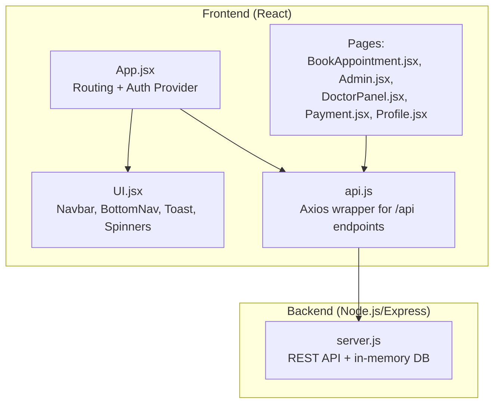
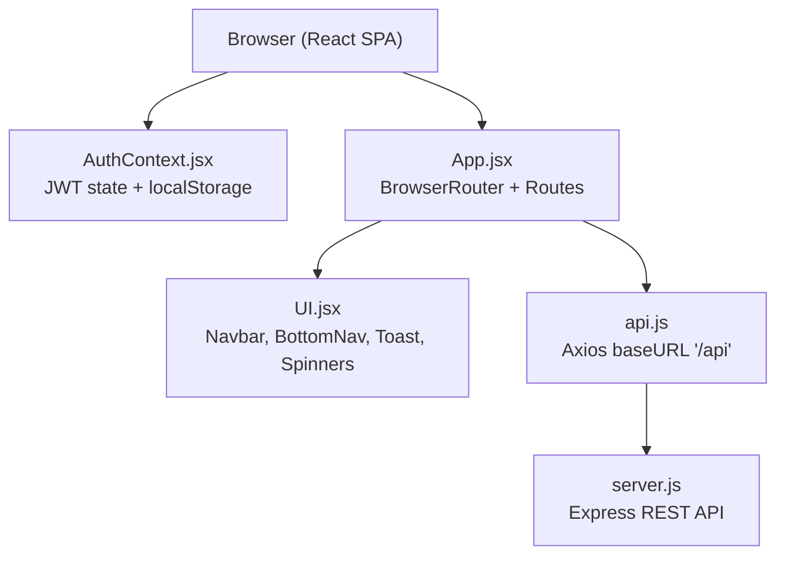
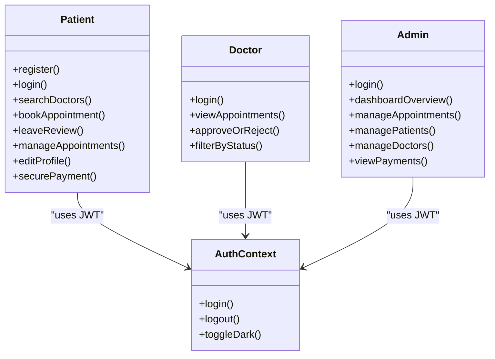
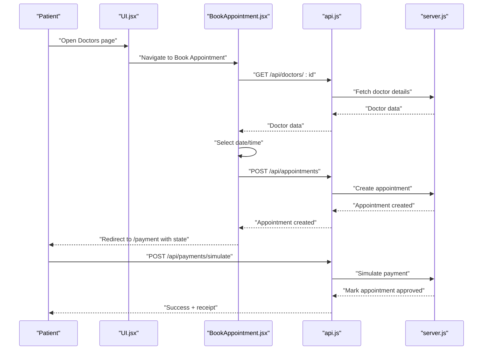
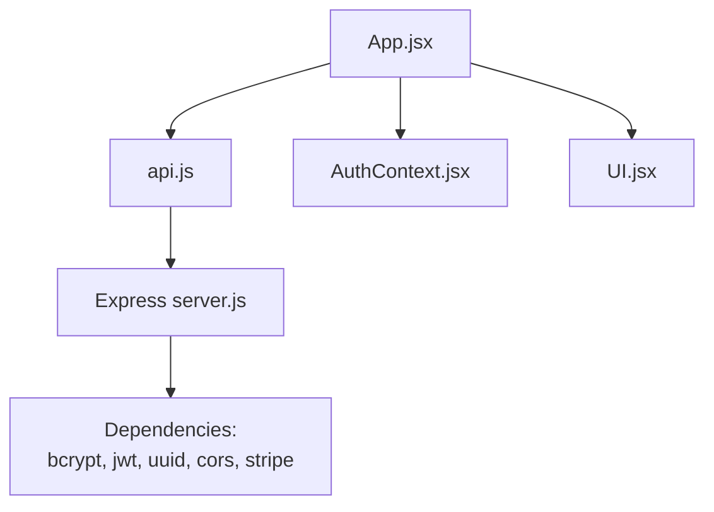

# Project Overview

<cite>
**Referenced Files in This Document**
- [README.md](file://README.md)
- [package.json](file://package.json)
- [server.js](file://server.js)
- [App.jsx](file://App.jsx)
- [AuthContext.jsx](file://AuthContext.jsx)
- [api.js](file://api.js)
- [BookAppointment.jsx](file://BookAppointment.jsx)
- [Admin.jsx](file://Admin.jsx)
- [DoctorPanel.jsx](file://DoctorPanel.jsx)
- [Payment.jsx](file://Payment.jsx)
- [Profile.jsx](file://Profile.jsx)
- [UI.jsx](file://UI.jsx)
- [index.html](file://index.html)
- [style.css](file://style.css)
</cite>

## Table of Contents
1. [Introduction](#introduction)
2. [Project Structure](#project-structure)
3. [Core Components](#core-components)
4. [Architecture Overview](#architecture-overview)
5. [Detailed Component Analysis](#detailed-component-analysis)
6. [Dependency Analysis](#dependency-analysis)
7. [Performance Considerations](#performance-considerations)
8. [Troubleshooting Guide](#troubleshooting-guide)
9. [Conclusion](#conclusion)
10. [Appendices](#appendices)

## Introduction
MediBook is a full-stack healthcare platform designed to streamline doctor appointment booking. It provides a seamless experience for patients to search, review, and book appointments, while equipping doctors and administrators with dedicated dashboards to manage requests and oversee operations. Built with modern web technologies, the system emphasizes usability, security, and scalability.

Key benefits:
- For patients: convenient online booking, real-time availability, secure payment, and easy profile management.
- For doctors: centralized panel to review and approve appointments, filter by status, and maintain visibility.
- For administrators: comprehensive analytics, centralized control over appointments and user accounts, and financial oversight.

## Project Structure
The project is organized into a React frontend and a Node.js/Express backend. The frontend handles routing, UI components, and user interactions, while the backend exposes REST APIs for authentication, doctor listings, appointments, payments, and administrative controls. A shared API module encapsulates HTTP calls to the backend.

**Diagram sources**
- [App.jsx](file://App.jsx#L1-L44)
- [UI.jsx](file://UI.jsx#L1-L182)
- [api.js](file://api.js#L1-L44)
- [BookAppointment.jsx](file://BookAppointment.jsx#L1-L171)
- [Admin.jsx](file://Admin.jsx#L1-L194)
- [DoctorPanel.jsx](file://DoctorPanel.jsx#L1-L96)
- [Payment.jsx](file://Payment.jsx#L1-L350)
- [Profile.jsx](file://Profile.jsx#L1-L97)
- [server.js](file://server.js#L1-L390)

**Section sources**
- [README.md](file://README.md#L7-L33)
- [App.jsx](file://App.jsx#L1-L44)
- [api.js](file://api.js#L1-L44)
- [server.js](file://server.js#L1-L30)

## Core Components
- Authentication and routing: Centralized routing with protected routes and role-aware navigation.
- Multi-role architecture: Patients, doctors, and administrators each have distinct dashboards and capabilities.
- Booking workflow: Search doctors → select time slot → confirm booking → payment → receipt.
- Payment integration: Stripe-ready endpoints with a simulated payment flow for demonstration.
- Administrative dashboard: Analytics, user management, and operational controls.

**Section sources**
- [App.jsx](file://App.jsx#L1-L44)
- [AuthContext.jsx](file://AuthContext.jsx#L1-L41)
- [UI.jsx](file://UI.jsx#L96-L176)
- [BookAppointment.jsx](file://BookAppointment.jsx#L1-L171)
- [Payment.jsx](file://Payment.jsx#L1-L350)
- [Admin.jsx](file://Admin.jsx#L1-L194)
- [DoctorPanel.jsx](file://DoctorPanel.jsx#L1-L96)

## Architecture Overview
The system follows a client-server architecture:
- Frontend: React SPA with React Router for navigation and a global AuthContext for JWT state management.
- Backend: Express server exposing REST endpoints for authentication, doctor listings, appointments, payments, and admin operations.
- Data: In-memory storage simulating relational tables; future enhancements include connecting to a persistent database.

**Diagram sources**
- [AuthContext.jsx](file://AuthContext.jsx#L1-L41)
- [App.jsx](file://App.jsx#L1-L44)
- [UI.jsx](file://UI.jsx#L1-L182)
- [api.js](file://api.js#L1-L44)
- [server.js](file://server.js#L1-L30)

## Detailed Component Analysis

### Multi-Role Architecture
- Patient module: Registration/login, doctor search/filter, booking, reviews, appointment management, profile editing, and payment.
- Doctor module: Login, view incoming appointments, approve/reject, and filter by status.
- Admin module: Login, dashboard overview, manage appointments, view patients/doctors, and payment analytics.

**Diagram sources**
- [AuthContext.jsx](file://AuthContext.jsx#L1-L41)
- [BookAppointment.jsx](file://BookAppointment.jsx#L1-L171)
- [DoctorPanel.jsx](file://DoctorPanel.jsx#L1-L96)
- [Admin.jsx](file://Admin.jsx#L1-L194)

**Section sources**
- [README.md](file://README.md#L68-L100)
- [AuthContext.jsx](file://AuthContext.jsx#L1-L41)
- [Admin.jsx](file://Admin.jsx#L1-L194)
- [DoctorPanel.jsx](file://DoctorPanel.jsx#L1-L96)

### Booking and Payment Workflow
End-to-end flow from search to confirmation and payment:

**Diagram sources**
- [BookAppointment.jsx](file://BookAppointment.jsx#L1-L171)
- [Payment.jsx](file://Payment.jsx#L1-L350)
- [api.js](file://api.js#L1-L44)
- [server.js](file://server.js#L167-L218)
- [server.js](file://server.js#L284-L377)

**Section sources**
- [BookAppointment.jsx](file://BookAppointment.jsx#L1-L171)
- [Payment.jsx](file://Payment.jsx#L1-L350)
- [api.js](file://api.js#L1-L44)
- [server.js](file://server.js#L167-L218)
- [server.js](file://server.js#L284-L377)

### UI/UX and Theming
- Dark/light mode toggle persisted in localStorage and applied via CSS variables.
- Responsive design with a mobile bottom navigation tailored per role.
- Toast notifications, loading spinners, star ratings, and confirmation probability indicators.

**Section sources**
- [AuthContext.jsx](file://AuthContext.jsx#L1-L41)
- [UI.jsx](file://UI.jsx#L1-L182)
- [style.css](file://style.css#L1-L765)

## Dependency Analysis
- Frontend dependencies include React, react-router-dom, axios, and local state management.
- Backend dependencies include Express, bcryptjs, jsonwebtoken, uuid, cors, and Stripe (optional).
- The frontend communicates exclusively through the /api base path, ensuring clean separation of concerns.

**Diagram sources**
- [api.js](file://api.js#L1-L44)
- [App.jsx](file://App.jsx#L1-L44)
- [AuthContext.jsx](file://AuthContext.jsx#L1-L41)
- [UI.jsx](file://UI.jsx#L1-L182)
- [server.js](file://server.js#L1-L30)
- [package.json](file://package.json#L14-L22)

**Section sources**
- [package.json](file://package.json#L1-L24)
- [server.js](file://server.js#L1-L30)
- [api.js](file://api.js#L1-L44)

## Performance Considerations
- Current in-memory storage is suitable for development/demo but should be replaced with a persistent database for production.
- Frontend routing and component lazy loading could improve initial load performance.
- API calls are straightforward; caching and pagination for large datasets can be considered later.
- Payment simulation avoids external dependencies during development, simplifying setup.

[No sources needed since this section provides general guidance]

## Troubleshooting Guide
Common issues and resolutions:
- Authentication errors: Verify JWT presence and validity; ensure Authorization header is set for protected routes.
- Booking conflicts: Check for existing appointments at the same date/time; slot availability is validated server-side.
- Payment failures: Validate card/mobile/bank details according to frontend formatting rules; ensure the demo payment endpoint is reachable.
- Admin access: Confirm role-based middleware allows only admins to access admin routes.

**Section sources**
- [server.js](file://server.js#L49-L62)
- [server.js](file://server.js#L170-L202)
- [Payment.jsx](file://Payment.jsx#L62-L98)
- [Admin.jsx](file://Admin.jsx#L19-L24)

## Conclusion
MediBook delivers a robust foundation for an online doctor appointment system with clear role-based workflows, a polished UI/UX, and a scalable architecture. By integrating secure authentication, a streamlined booking and payment flow, and comprehensive administrative controls, it addresses key needs across patients, doctors, and administrators. Future enhancements include persistent database integration, live payment processing, and expanded features such as notifications and video consultations.

[No sources needed since this section summarizes without analyzing specific files]

## Appendices

### Technology Stack
- Frontend: React, React Router, Axios
- Backend: Node.js, Express
- Security: JWT, bcrypt
- Styling: CSS with theme variables and responsive design
- Optional payment: Stripe SDK (demo mode included)

**Section sources**
- [README.md](file://README.md#L3-L4)
- [package.json](file://package.json#L14-L22)
- [server.js](file://server.js#L1-L30)

### Database Schema (In-Memory)
Tables include patients, doctors, appointments, payments, and admins. The schema supports primary keys, foreign keys, enums, and timestamps.

**Section sources**
- [README.md](file://README.md#L103-L148)
- [server.js](file://server.js#L29-L44)

### Example Workflows
- Patient registers, logs in, searches for a doctor, selects a time slot, confirms booking, and completes payment via the simulated flow.
- Doctor receives appointment requests, filters by status, and approves/rejects accordingly.
- Administrator reviews system statistics, manages users and appointments, and monitors payments.

**Section sources**
- [BookAppointment.jsx](file://BookAppointment.jsx#L1-L171)
- [DoctorPanel.jsx](file://DoctorPanel.jsx#L1-L96)
- [Admin.jsx](file://Admin.jsx#L1-L194)
- [Payment.jsx](file://Payment.jsx#L1-L350)