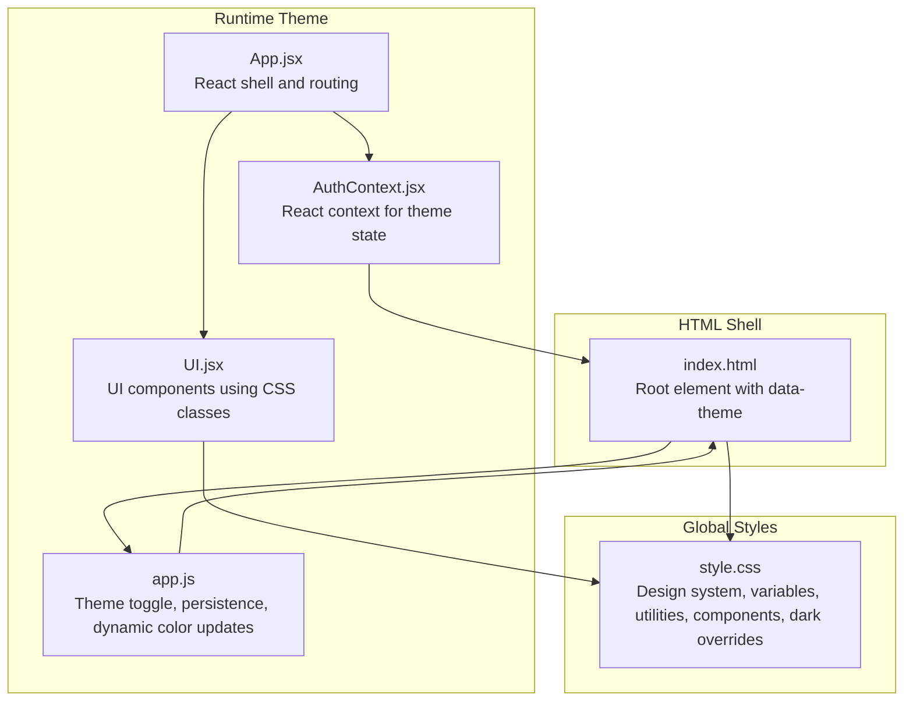
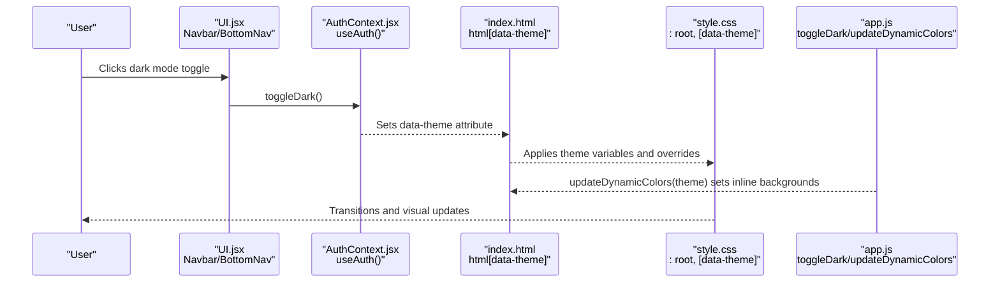
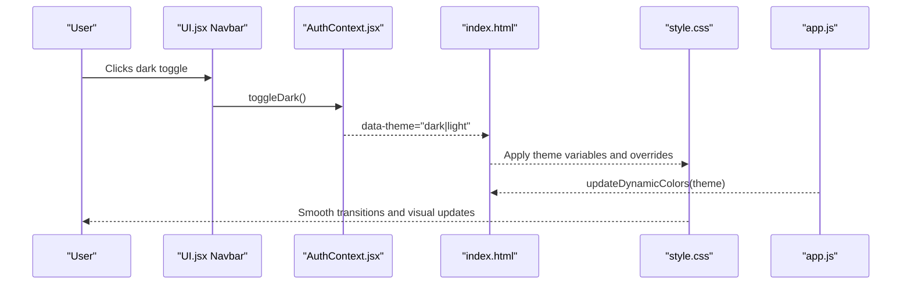
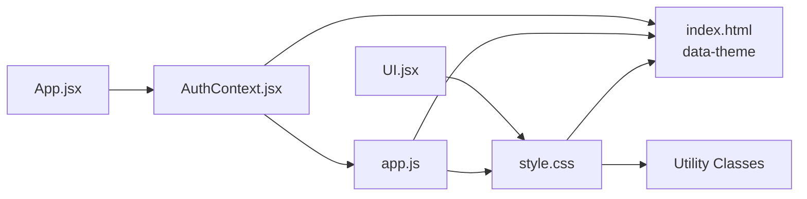

# Styling and Theming

<cite>
**Referenced Files in This Document**
- [style.css](file://style.css)
- [index.html](file://index.html)
- [app.js](file://app.js)
- [AuthContext.jsx](file://AuthContext.jsx)
- [UI.jsx](file://UI.jsx)
- [App.jsx](file://App.jsx)
- [README.md](file://README.md)
</cite>

## Table of Contents
1. [Introduction](#introduction)
2. [Project Structure](#project-structure)
3. [Core Components](#core-components)
4. [Architecture Overview](#architecture-overview)
5. [Detailed Component Analysis](#detailed-component-analysis)
6. [Dependency Analysis](#dependency-analysis)
7. [Performance Considerations](#performance-considerations)
8. [Troubleshooting Guide](#troubleshooting-guide)
9. [Conclusion](#conclusion)
10. [Appendices](#appendices)

## Introduction
This document explains the styling and theming architecture of the Doctor appointment booking system. It covers the CSS design system, dark mode implementation, responsive patterns, color and typography systems, CSS custom properties, component styling approaches, animations/transitions, integration with UI components, and guidelines for extending the design system while maintaining consistency and performance.

## Project Structure
The styling system is primarily implemented in a single stylesheet with complementary HTML and JavaScript for theme switching and component composition. The React application wraps the HTML shell and renders pages, while the global CSS defines the design system and theme.

**Diagram sources**
- [index.html](file://index.html#L2-L10)
- [style.css](file://style.css#L7-L58)
- [app.js](file://app.js#L47-L105)
- [AuthContext.jsx](file://AuthContext.jsx#L6-L19)
- [UI.jsx](file://UI.jsx#L96-L138)
- [App.jsx](file://App.jsx#L15-L42)

**Section sources**
- [index.html](file://index.html#L1-L531)
- [style.css](file://style.css#L1-L974)
- [app.js](file://app.js#L1-L840)
- [AuthContext.jsx](file://AuthContext.jsx#L1-L41)
- [UI.jsx](file://UI.jsx#L1-L182)
- [App.jsx](file://App.jsx#L1-L44)

## Core Components
- Design system variables: CSS custom properties define a cohesive palette, shadows, radii, and typography scales.
- Dark mode: A dedicated selector toggles theme variables and includes explicit overrides for gradients and backgrounds.
- Utility classes: Layout helpers, grid, spacing, and visibility utilities enable rapid composition.
- Component classes: Buttons, forms, cards, badges, navigation, and page-specific sections.
- Animations/transitions: Smooth transitions for theme changes, hover states, and micro-interactions.
- Responsive breakpoints: Media queries adapt layout for tablets and phones.

**Section sources**
- [style.css](file://style.css#L7-L58)
- [style.css](file://style.css#L658-L765)
- [style.css](file://style.css#L96-L107)
- [style.css](file://style.css#L109-L133)
- [style.css](file://style.css#L134-L151)
- [style.css](file://style.css#L152-L157)
- [style.css](file://style.css#L158-L165)
- [style.css](file://style.css#L169-L217)
- [style.css](file://style.css#L221-L246)
- [style.css](file://style.css#L247-L252)
- [style.css](file://style.css#L253-L261)
- [style.css](file://style.css#L262-L273)
- [style.css](file://style.css#L274-L283)
- [style.css](file://style.css#L284-L373)
- [style.css](file://style.css#L374-L431)
- [style.css](file://style.css#L432-L556)
- [style.css](file://style.css#L557-L656)
- [style.css](file://style.css#L657-L765)
- [style.css](file://style.css#L766-L974)

## Architecture Overview
The theming architecture combines:
- CSS custom properties for theme tokens.
- A data-attribute on the root element to switch themes.
- Persistence in local storage.
- Dynamic color updates for elements that cannot rely solely on CSS variables.
- React context to propagate theme state to UI components.

**Diagram sources**
- [UI.jsx](file://UI.jsx#L127-L137)
- [AuthContext.jsx](file://AuthContext.jsx#L34-L35)
- [index.html](file://index.html#L2)
- [style.css](file://style.css#L35-L58)
- [app.js](file://app.js#L47-L84)

## Detailed Component Analysis

### Design System Variables and Tokens
- Color palette: Greens, gold, cream, white, borders, surfaces, and semantic statuses (danger, success, warning).
- Typography: Headings use a serif font; body uses a sans-serif font.
- Shadows and radii: Consistent elevation and corner radii for depth and legibility.
- Spacing: Defined via CSS custom properties for padding and gaps.

Guidelines:
- Use CSS variables for all colors, radii, and shadows to ensure consistent theming.
- Prefer semantic tokens (e.g., surface, border) over hardcoded values.

**Section sources**
- [style.css](file://style.css#L7-L33)
- [style.css](file://style.css#L83-L95)

### Dark Mode Implementation
- Theme switching: Toggles a data-attribute on the root element and persists the choice in local storage.
- System preference detection: On load, reads saved theme or prefers-color-scheme.
- Explicit overrides: Specific selectors override gradients and backgrounds that cannot use CSS variables.
- Scrollbar theming: Customized for dark mode.

Integration points:
- HTML root attribute controls theme.
- React context exposes theme state and toggle.
- JavaScript updates dynamic colors and applies transitions.

**Section sources**
- [index.html](file://index.html#L2)
- [style.css](file://style.css#L35-L58)
- [style.css](file://style.css#L682-L765)
- [AuthContext.jsx](file://AuthContext.jsx#L6-L19)
- [app.js](file://app.js#L47-L105)
- [app.js](file://app.js#L57-L84)

### Responsive Design and Mobile-First Approach
- Breakpoints: Media queries at tablet and phone widths adjust grids, navigation, and typography.
- Mobile navigation: Bottom navigation appears on small screens.
- Content density: Adjusts hero layout, form rows, and statistics presentation.

Patterns:
- Use grid utilities and container helpers for flexible layouts.
- Hide desktop-only elements on smaller screens.
- Clamp and fluid sizing for typography.

**Section sources**
- [style.css](file://style.css#L658-L680)
- [style.css](file://style.css#L221-L234)
- [style.css](file://style.css#L287-L317)
- [style.css](file://style.css#L341-L351)
- [style.css](file://style.css#L366-L373)

### Component Styling Patterns
- Buttons: Primary, outline, ghost, gold, danger, sizes, and icons.
- Forms: Labels, inputs, selects, textareas, focus states, and error messaging.
- Cards: Surfaces with borders, shadows, and hover states.
- Badges: Status indicators with semantic colors.
- Navigation: Sticky navbar with backdrop blur and active states.
- Toasts, spinners, stars, probability bars, countdown timers, empty states, divider, and page wrappers.

**Section sources**
- [style.css](file://style.css#L109-L133)
- [style.css](file://style.css#L134-L151)
- [style.css](file://style.css#L152-L157)
- [style.css](file://style.css#L158-L165)
- [style.css](file://style.css#L169-L217)
- [style.css](file://style.css#L235-L246)
- [style.css](file://style.css#L247-L252)
- [style.css](file://style.css#L253-L261)
- [style.css](file://style.css#L262-L273)
- [style.css](file://style.css#L274-L283)

### Animation and Transition Effects
- Universal transitions: Background, border, color, and shadow transitions across elements.
- Component-specific transitions: Buttons, toggle, progress bar width, and keyframe-driven animations (floating card, spinner, slide-in, pop-in, dot bounce).
- Micro-interactions: Hover states, focus rings, and subtle transforms.

**Section sources**
- [style.css](file://style.css#L62-L80)
- [style.css](file://style.css#L312-L317)
- [style.css](file://style.css#L247-L252)
- [style.css](file://style.css#L241-L246)
- [style.css](file://style.css#L627-L631)
- [style.css](file://style.css#L641-L651)

### Integration Between CSS and UI Components
- HTML shell provides base classes and containers for pages and navigation.
- React components (Navbar, BottomNav, ToastContainer) render UI elements that rely on CSS classes.
- JavaScript toggles theme and updates dynamic colors for elements that cannot use CSS variables.

**Section sources**
- [index.html](file://index.html#L11-L531)
- [UI.jsx](file://UI.jsx#L11-L25)
- [UI.jsx](file://UI.jsx#L96-L138)
- [UI.jsx](file://UI.jsx#L140-L176)
- [app.js](file://app.js#L47-L84)

### Example: Theme Switching Flow

**Diagram sources**
- [UI.jsx](file://UI.jsx#L127-L137)
- [AuthContext.jsx](file://AuthContext.jsx#L34-L35)
- [index.html](file://index.html#L2)
- [style.css](file://style.css#L35-L58)
- [app.js](file://app.js#L47-L84)

## Dependency Analysis
- CSS depends on:
  - Root variables for theme tokens.
  - Data-attribute selectors for theme overrides.
  - Utility classes for layout and composition.
- JavaScript depends on:
  - Local storage for persistence.
  - Inline styles for dynamic color updates.
- React context depends on:
  - Local storage for initial theme state.
  - HTML data-attribute for theme propagation.

**Diagram sources**
- [style.css](file://style.css#L7-L58)
- [index.html](file://index.html#L2)
- [app.js](file://app.js#L47-L105)
- [AuthContext.jsx](file://AuthContext.jsx#L6-L19)
- [UI.jsx](file://UI.jsx#L96-L138)
- [App.jsx](file://App.jsx#L15-L42)

**Section sources**
- [style.css](file://style.css#L1-L974)
- [index.html](file://index.html#L1-L531)
- [app.js](file://app.js#L1-L840)
- [AuthContext.jsx](file://AuthContext.jsx#L1-L41)
- [UI.jsx](file://UI.jsx#L1-L182)
- [App.jsx](file://App.jsx#L1-L44)

## Performance Considerations
- CSS variables reduce duplication and improve runtime switching performance.
- Minimal JavaScript for theme updates avoids layout thrashing.
- Utility classes promote efficient composition without custom CSS bloat.
- Media queries are scoped to necessary breakpoints to minimize reflows.
- Preconnect fonts to reduce render-blocking.

Recommendations:
- Keep theme variables centralized in the root scope.
- Avoid excessive inline styles; prefer CSS classes.
- Use CSS containment and isolation for heavy components.
- Lazy-load non-critical assets and defer non-essential scripts.

[No sources needed since this section provides general guidance]

## Troubleshooting Guide
Common issues and resolutions:
- Theme not persisting: Verify local storage keys and initialization logic.
- Dark mode not applying to specific sections: Ensure explicit overrides are present for elements that cannot use CSS variables.
- Transitions feel sluggish: Confirm transition durations and properties are reasonable; avoid animating expensive properties.
- Mobile navigation missing: Check media query conditions and bottom navigation class presence.

**Section sources**
- [AuthContext.jsx](file://AuthContext.jsx#L6-L19)
- [app.js](file://app.js#L86-L105)
- [style.css](file://style.css#L658-L765)
- [style.css](file://style.css#L62-L80)
- [style.css](file://style.css#L658-L680)

## Conclusion
The styling and theming system employs a clean, maintainable approach centered on CSS custom properties, a data-attribute theme selector, and explicit overrides for complex backgrounds. The design system’s variables, utilities, and component classes enable consistent, responsive experiences across devices. The integration with React and JavaScript ensures smooth theme transitions and persistence, while performance-conscious patterns support efficient rendering.

[No sources needed since this section summarizes without analyzing specific files]

## Appendices

### Color Scheme and Typography System
- Color scheme: Deep forest green, warm cream, gold accents, muted grays, and semantic statuses.
- Typography: Serif headings and sans-serif body.
- Radii and shadows: Consistent corner radii and layered shadows for depth.

**Section sources**
- [style.css](file://style.css#L7-L33)
- [style.css](file://style.css#L83-L95)

### Spacing Conventions
- Use utility classes for gaps and margins.
- Container and page wrappers define maximum widths and paddings.

**Section sources**
- [style.css](file://style.css#L96-L107)
- [style.css](file://style.css#L274-L277)

### CSS Custom Properties and Variables
- Define theme tokens in the root scope.
- Reference tokens consistently across components.

**Section sources**
- [style.css](file://style.css#L7-L33)

### BEM and Naming Patterns
- Component classes use a flat naming convention (e.g., .btn, .card, .navbar).
- Modifier classes indicate states (e.g., .active, .hidden).
- Utility classes encapsulate layout and spacing.

**Section sources**
- [style.css](file://style.css#L96-L107)
- [style.css](file://style.css#L109-L133)
- [style.css](file://style.css#L134-L151)
- [style.css](file://style.css#L152-L157)
- [style.css](file://style.css#L158-L165)
- [style.css](file://style.css#L169-L217)

### Animation and Transition Guidelines
- Use universal transitions for smooth theme changes.
- Apply targeted transitions for interactive elements.
- Utilize keyframes for micro-interactions.

**Section sources**
- [style.css](file://style.css#L62-L80)
- [style.css](file://style.css#L312-L317)
- [style.css](file://style.css#L247-L252)
- [style.css](file://style.css#L241-L246)
- [style.css](file://style.css#L627-L631)
- [style.css](file://style.css#L641-L651)

### Adding New Styles and Extending the Design System
- Add new tokens to the root scope.
- Create component classes following naming conventions.
- Use utility classes for layout and spacing.
- Test dark mode overrides for new components.
- Keep transitions and animations consistent.

**Section sources**
- [style.css](file://style.css#L7-L33)
- [style.css](file://style.css#L96-L107)
- [style.css](file://style.css#L109-L133)
- [style.css](file://style.css#L658-L765)

### Theme Customization Examples
- Modify root variables to adjust palette.
- Extend dark overrides for new sections.
- Use utility classes to compose layouts quickly.

**Section sources**
- [style.css](file://style.css#L7-L33)
- [style.css](file://style.css#L682-L765)

### Breakpoint Management
- Use media queries for tablet and phone widths.
- Hide desktop-only elements on smaller screens.
- Adjust grids and typography for optimal readability.

**Section sources**
- [style.css](file://style.css#L658-L680)

### Cross-Browser Compatibility Considerations
- CSS variables are widely supported; ensure fallbacks for legacy environments if needed.
- Use vendor prefixes sparingly; modern browsers handle most properties.
- Test transitions and transforms across devices.

[No sources needed since this section provides general guidance]