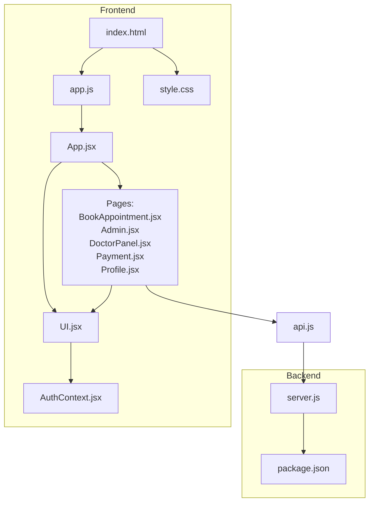
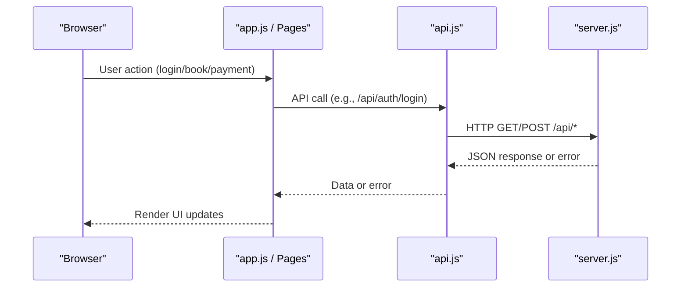
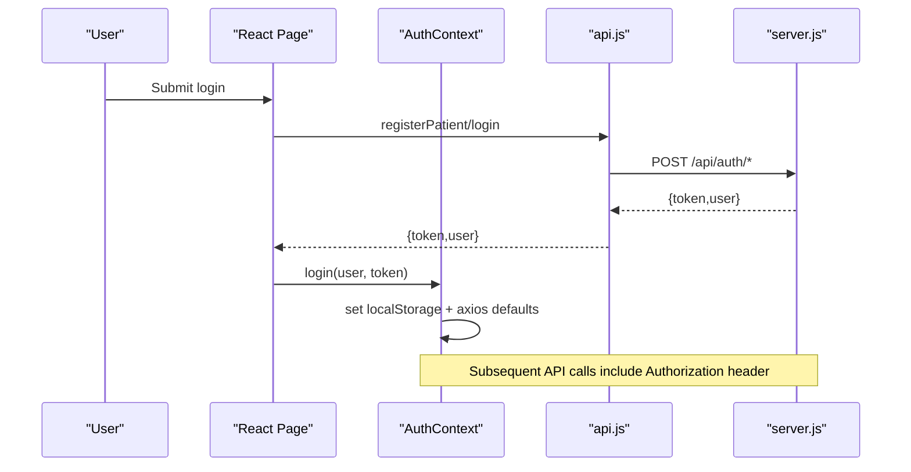
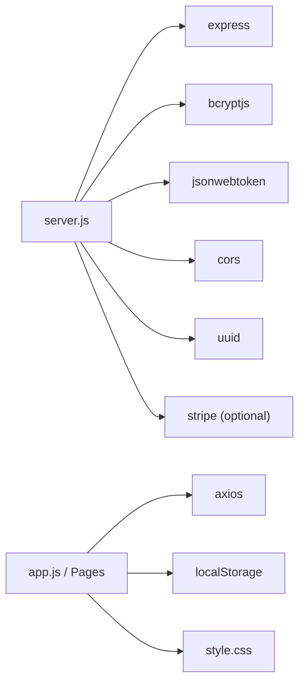

# Troubleshooting and FAQ

<cite>
**Referenced Files in This Document**
- [README.md](file://README.md)
- [package.json](file://package.json)
- [server.js](file://server.js)
- [index.html](file://index.html)
- [app.js](file://app.js)
- [AuthContext.jsx](file://AuthContext.jsx)
- [api.js](file://api.js)
- [App.jsx](file://App.jsx)
- [BookAppointment.jsx](file://BookAppointment.jsx)
- [UI.jsx](file://UI.jsx)
- [Admin.jsx](file://Admin.jsx)
- [DoctorPanel.jsx](file://DoctorPanel.jsx)
- [Payment.jsx](file://Payment.jsx)
- [Profile.jsx](file://Profile.jsx)
- [style.css](file://style.css)
</cite>

## Table of Contents
1. [Introduction](#introduction)
2. [Project Structure](#project-structure)
3. [Core Components](#core-components)
4. [Architecture Overview](#architecture-overview)
5. [Detailed Component Analysis](#detailed-component-analysis)
6. [Dependency Analysis](#dependency-analysis)
7. [Performance Considerations](#performance-considerations)
8. [Troubleshooting Guide](#troubleshooting-guide)
9. [Conclusion](#conclusion)
10. [Appendices](#appendices)

## Introduction
This document provides comprehensive troubleshooting and Frequently Asked Questions for the Doctor appointment booking system. It covers installation and environment setup, authentication and session issues, API connectivity and CORS, frontend rendering and state management, database in-memory persistence, debugging strategies, performance optimization, security considerations, and escalation procedures.

## Project Structure
The system is a full-stack application with a Node.js/Express backend and a single-page React frontend. The backend serves static assets and exposes REST APIs. The frontend is a hybrid HTML/JS app with React components and a global state management approach.

**Diagram sources**
- [server.js](file://server.js#L1-L390)
- [index.html](file://index.html#L1-L531)
- [app.js](file://app.js#L1-L857)
- [AuthContext.jsx](file://AuthContext.jsx#L1-L41)
- [api.js](file://api.js#L1-L44)
- [App.jsx](file://App.jsx#L1-L44)
- [BookAppointment.jsx](file://BookAppointment.jsx#L1-L171)
- [Admin.jsx](file://Admin.jsx#L1-L194)
- [DoctorPanel.jsx](file://DoctorPanel.jsx#L1-L96)
- [Payment.jsx](file://Payment.jsx#L1-L350)
- [Profile.jsx](file://Profile.jsx#L1-L97)
- [style.css](file://style.css#L1-L974)

**Section sources**
- [README.md](file://README.md#L1-L159)
- [server.js](file://server.js#L1-L390)
- [index.html](file://index.html#L1-L531)
- [app.js](file://app.js#L1-L857)
- [AuthContext.jsx](file://AuthContext.jsx#L1-L41)
- [api.js](file://api.js#L1-L44)
- [App.jsx](file://App.jsx#L1-L44)
- [BookAppointment.jsx](file://BookAppointment.jsx#L1-L171)
- [Admin.jsx](file://Admin.jsx#L1-L194)
- [DoctorPanel.jsx](file://DoctorPanel.jsx#L1-L96)
- [Payment.jsx](file://Payment.jsx#L1-L350)
- [Profile.jsx](file://Profile.jsx#L1-L97)
- [style.css](file://style.css#L1-L974)

## Core Components
- Backend server: Express-based REST API with in-memory storage, JWT authentication middleware, and payment simulation via Stripe.
- Frontend SPA: Single HTML shell with embedded scripts, React-like state management in app.js, and modular UI components.
- Authentication: JWT-based sessions persisted in localStorage; AuthContext manages token propagation to Axios defaults.
- API client: Centralized api.js exports typed API calls; app.js also uses direct fetch for payment and doctor fee retrieval.
- Styling: CSS variables and dark mode toggle persisted in localStorage.

Common issues often stem from:
- Environment variable misconfiguration (JWT secret, Stripe key)
- CORS and proxy configuration for local development
- Token propagation and missing Authorization headers
- In-memory data resets on server restart
- Payment service setup and validation

**Section sources**
- [server.js](file://server.js#L1-L390)
- [AuthContext.jsx](file://AuthContext.jsx#L1-L41)
- [api.js](file://api.js#L1-L44)
- [app.js](file://app.js#L1-L857)
- [style.css](file://style.css#L1-L974)

## Architecture Overview
The frontend communicates with the backend via /api routes. Authentication tokens are attached to requests either via Axios defaults (React components) or manual Authorization headers (direct fetch in Payment.jsx).

**Diagram sources**
- [app.js](file://app.js#L1-L857)
- [api.js](file://api.js#L1-L44)
- [server.js](file://server.js#L1-L390)

## Detailed Component Analysis

### Authentication and Session Management
- Token storage: localStorage for mb-token and mb-user; AuthContext persists theme preference.
- Token propagation: AuthContext sets Authorization header globally for Axios; app.js manually attaches Bearer token for fetch calls.
- Middleware: authMiddleware validates JWT and enforces role-based access.

Common issues:
- Missing Authorization header leading to 401 responses
- Token mismatch between localStorage and backend
- Role-based routing bypass attempts

**Diagram sources**
- [AuthContext.jsx](file://AuthContext.jsx#L1-L41)
- [api.js](file://api.js#L1-L44)
- [server.js](file://server.js#L49-L62)

**Section sources**
- [AuthContext.jsx](file://AuthContext.jsx#L1-L41)
- [api.js](file://api.js#L1-L44)
- [server.js](file://server.js#L49-L110)
- [app.js](file://app.js#L9-L33)

### API Connectivity and CORS
- Backend enables CORS globally and serves static files.
- Frontend uses relative /api base; ensure dev server proxies correctly if applicable.
- Payment simulation uses direct fetch to /api/payments/fee and /api/payments/simulate.

Common issues:
- CORS preflight/block errors in browser console
- 404/403 due to missing Authorization header
- Stripe key not configured causing payment route failures

**Section sources**
- [server.js](file://server.js#L22-L24)
- [Payment.jsx](file://Payment.jsx#L52-L55)
- [Payment.jsx](file://Payment.jsx#L80-L98)

### Frontend Rendering and State Management
- app.js maintains in-memory state and local fallback cache; UI updates via DOM manipulation and React-like hooks.
- UI.jsx provides reusable components (toasts, spinner, stars, countdown).
- Pages coordinate navigation and data fetching.

Common issues:
- State not updating after API calls
- Toast messages not appearing
- Dark mode not persisting across reloads
- Slot availability not recalculated after date change

**Section sources**
- [app.js](file://app.js#L42-L105)
- [UI.jsx](file://UI.jsx#L1-L182)
- [BookAppointment.jsx](file://BookAppointment.jsx#L1-L171)

### Database and In-Memory Persistence
- DB is initialized in server.js with seed data; all CRUD operations mutate in-memory arrays.
- No persistence across server restarts; data resets on process restart.

Common issues:
- Data disappears after restarting the server
- Conflicts or duplicates due to lack of unique constraints outside in-memory checks

**Section sources**
- [server.js](file://server.js#L29-L44)

### Payments and Stripe Integration
- Payment simulation endpoint accepts card/mobile/bank details and marks appointment as approved.
- Real Stripe integration requires STRIPE_SECRET_KEY environment variable.

Common issues:
- Payment route returns 503 when Stripe key is missing
- Validation errors for card/mobile/bank fields
- Payment not reflected in appointment status

**Section sources**
- [server.js](file://server.js#L297-L353)
- [Payment.jsx](file://Payment.jsx#L62-L98)

## Dependency Analysis
External dependencies include Express, bcryptjs, jsonwebtoken, cors, uuid, and stripe. The frontend uses Axios for API calls and React-like state management.

**Diagram sources**
- [server.js](file://server.js#L5-L19)
- [package.json](file://package.json#L14-L22)
- [app.js](file://app.js#L1-L857)

**Section sources**
- [package.json](file://package.json#L1-L24)
- [server.js](file://server.js#L5-L19)

## Performance Considerations
- Minimize re-renders by avoiding unnecessary state updates in app.js.
- Debounce search/filter operations in UI components.
- Lazy-load heavy computations (e.g., probability calculations) only when needed.
- Avoid frequent DOM queries; cache selectors where possible.
- Use CSS custom properties and avoid forced synchronous layouts.

[No sources needed since this section provides general guidance]

## Troubleshooting Guide

### Installation and Environment Setup
- Ensure Node.js and npm are installed.
- Install dependencies for both backend and frontend as per project structure.
- Set environment variables:
  - JWT_SECRET for JWT signing
  - STRIPE_SECRET_KEY for Stripe integration (optional for demo)
- Verify ports:
  - Backend runs on port 5000 by default
  - Frontend runs on port 3000 in typical setups

Common symptoms and fixes:
- Missing dependencies: run npm install in backend/frontend directories.
- Port conflicts: change PORT environment variable or stop conflicting services.
- Stripe errors: configure STRIPE_SECRET_KEY or rely on payment simulation.

**Section sources**
- [README.md](file://README.md#L37-L53)
- [server.js](file://server.js#L13-L19)
- [package.json](file://package.json#L1-L24)

### Authentication and Session Issues
Symptoms:
- Redirect loops to login
- 401 Unauthorized on protected routes
- Token appears valid but requests still fail

Diagnosis steps:
- Check localStorage entries for mb-token and mb-user.
- Verify Authorization header presence in network tab for /api routes.
- Confirm JWT_SECRET matches between frontend and backend.
- Ensure role-based routing aligns with user role claims.

Fixes:
- Clear localStorage and re-login to refresh tokens.
- Confirm AuthContext sets axios defaults and app.js attaches Authorization header for fetch.
- Adjust JWT_SECRET to a consistent value across environments.

**Section sources**
- [AuthContext.jsx](file://AuthContext.jsx#L11-L14)
- [app.js](file://app.js#L15-L17)
- [server.js](file://server.js#L49-L62)

### API Connectivity and CORS
Symptoms:
- CORS errors in browser console
- Preflight OPTIONS requests failing
- 403 Access Denied on authenticated routes

Diagnosis steps:
- Confirm backend CORS is enabled.
- Verify /api base URL and route correctness.
- Check Authorization header presence for protected routes.

Fixes:
- Ensure backend serves static files and responds to /api/*.
- For development, configure proxy to forward /api to backend port.
- Validate token presence and expiration.

**Section sources**
- [server.js](file://server.js#L22-L24)
- [api.js](file://api.js#L3-L3)
- [server.js](file://server.js#L49-L62)

### Frontend Rendering and State Management
Symptoms:
- UI not updating after booking/payment
- Toast messages not visible
- Dark mode toggle not persisting

Diagnosis steps:
- Inspect React-like state updates in app.js.
- Verify DOM manipulation for page visibility and toasts.
- Check localStorage persistence for theme and user data.

Fixes:
- Ensure state setters trigger re-renders.
- Confirm toast container exists and animations complete.
- Persist theme and user data in localStorage.

**Section sources**
- [app.js](file://app.js#L108-L123)
- [UI.jsx](file://UI.jsx#L11-L25)
- [style.css](file://style.css#L35-L58)

### Database and In-Memory Persistence
Symptoms:
- Data lost after server restart
- Duplicate bookings despite in-memory checks

Diagnosis steps:
- Confirm DB initialization and mutation paths.
- Verify appointment conflict checks by doctor_id/date/time/status.

Fixes:
- Replace in-memory store with a persistent database (MySQL/MongoDB).
- Add unique constraints and robust conflict detection.

**Section sources**
- [server.js](file://server.js#L29-L44)
- [server.js](file://server.js#L170-L202)

### Payments and Stripe Integration
Symptoms:
- Payment route returns 503
- Validation errors for card/mobile/bank fields
- Payment not reflected in appointment status

Diagnosis steps:
- Check STRIPE_SECRET_KEY environment variable.
- Validate payment payload fields.
- Inspect payment simulation logic.

Fixes:
- Set STRIPE_SECRET_KEY or use payment simulation.
- Ensure card/mobile/bank validations pass.
- Confirm appointment status updates after payment.

**Section sources**
- [server.js](file://server.js#L13-L15)
- [server.js](file://server.js#L297-L353)
- [Payment.jsx](file://Payment.jsx#L62-L98)

### Debugging Strategies
Development:
- Enable browser developer tools; inspect Network tab for API responses.
- Log localStorage keys and values for auth/session.
- Use React DevTools to inspect component state and props.

Production:
- Capture server logs for unhandled errors.
- Monitor API latency and error rates.
- Collect client-side error logs via console/network.

**Section sources**
- [server.js](file://server.js#L389-L390)
- [app.js](file://app.js#L29-L32)

### Performance Optimization
- Optimize rendering by minimizing DOM updates and avoiding unnecessary re-renders.
- Cache computed values (e.g., confirmation probability) and invalidate on relevant state changes.
- Reduce layout thrashing by batching DOM reads/writes.
- Use CSS custom properties for theming and avoid expensive repaints.

[No sources needed since this section provides general guidance]

### Security Considerations
- Use HTTPS in production.
- Rotate JWT_SECRET regularly.
- Sanitize inputs and enforce strict validation on the server.
- Avoid storing sensitive data in localStorage; consider HttpOnly cookies for tokens if serving via a dedicated API.
- Limit CORS origins to trusted domains.

**Section sources**
- [server.js](file://server.js#L19-L20)
- [server.js](file://server.js#L68-L110)

### Frequently Asked Questions
- Q: How do I reset the demo data?
  - A: Restart the server to reinitialize in-memory DB with seed data.
- Q: Can I integrate a real database?
  - A: Yes; replace in-memory DB with MySQL/MongoDB and adapt routes accordingly.
- Q: Why does the payment page show a success message even without Stripe?
  - A: Payment simulation endpoint simulates a successful payment for demo purposes.
- Q: How do I enable dark mode?
  - A: Toggle the dark mode switch; preference is persisted in localStorage.

**Section sources**
- [server.js](file://server.js#L29-L44)
- [Payment.jsx](file://Payment.jsx#L91-L98)
- [style.css](file://style.css#L35-L58)

### Escalation Procedures and Support Resources
- For critical issues:
  - Collect server logs and browser console output.
  - Provide exact steps to reproduce and environment details.
  - Open an issue with relevant file references and error messages.
- Support resources:
  - Review README for setup and feature details.
  - Check backend logs for stack traces.
  - Validate environment variables and network connectivity.

**Section sources**
- [README.md](file://README.md#L1-L159)
- [server.js](file://server.js#L389-L390)

## Conclusion
This guide consolidates common issues and resolutions across installation, authentication, API connectivity, frontend rendering, persistence, payments, performance, and security. Use the troubleshooting sections and escalation procedures to diagnose and resolve issues efficiently.

[No sources needed since this section summarizes without analyzing specific files]

## Appendices

### Diagnostic Commands and Monitoring
- Backend startup and logs:
  - Start server and observe startup message.
- Frontend checks:
  - Verify /api routes in browser Network tab.
  - Confirm localStorage keys for auth and theme.
- Payment checks:
  - Validate consultation fee retrieval and payment simulation flow.

**Section sources**
- [server.js](file://server.js#L389-L390)
- [Payment.jsx](file://Payment.jsx#L52-L55)
- [Payment.jsx](file://Payment.jsx#L80-L98)